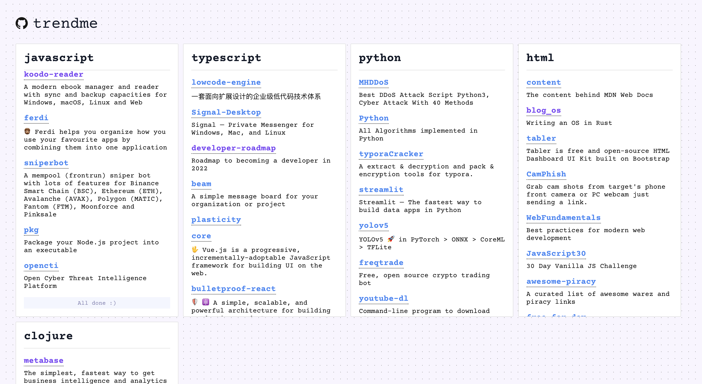

# trendme


A small website that aggregates github trending repos.  
It's my first project in clojure, so hopefuly the code is not too bad.  

By default you will have the languages: javascript, typescript, python, html, clojure.  
To display specific languages you have to use the url parameter `l` with a comma separated list of languages.  
ex: https://trendme.evass.co/?l=c,zig,rust  

Visit the website here: [Trendme](https://trendme.evass.co?l=javascript,typescript,html,css)

## Prerequisites

You will need [Leiningen](https://github.com/technomancy/leiningen) 2.0.0 or above installed.

## Commands

To run `lein ring server-headless`  
To build `lein ring uberjar`  
to run build `java -jar target/trendme-0.1.0-SNAPSHOT-standalone.jar`

## Run on server
These infos are mostly for me, but i guess you can use them too if you want to run it on systemd. 🤷‍♂️  

Create systemd file  
`sudo touch /usr/lib/systemd/system/trendme.service`

with this content:

```
[Unit]
Description=webserver Daemon

[Service]
ExecStart=java -jar /home/erwan/trendme/target/trendme-0.1.0-SNAPSHOT-standalone.jar

[Install]
WantedBy=multi-user.target
```

Run with `sudo service trendme start`  
Restart with `sudo service trendme restart`  
Enable on start `sudo service trendme enable`  
Disable on start `sudo service trendme disable`
